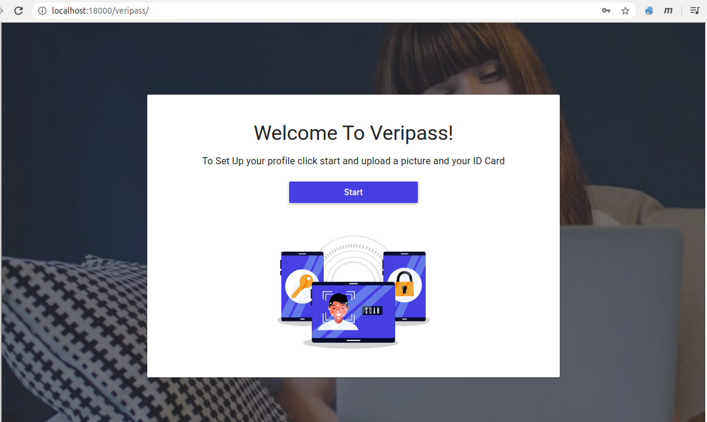
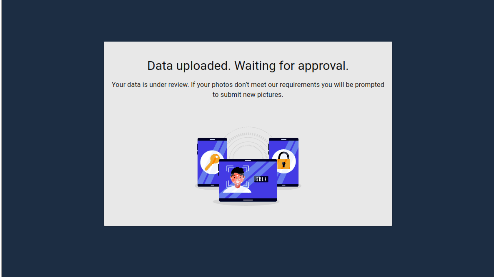
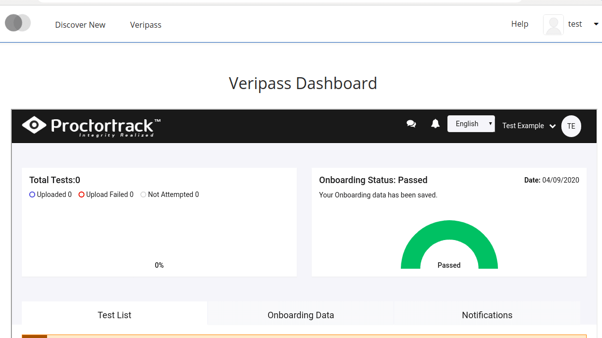

# edx-veripass
Veripass - Identity verification tool

## Overview
This is the student verification subsystem. This Python library provides the face and ID verificarion implementation used by Open edX.

## Dev Installation
To install edx-veripass:

``$ make lms-shell``

`` $ source /edx/app/edxapp/edxapp_env ``

`` $ pip install -e git+https://github.com/khushbu-07/edx-veripass.git@master#egg=edx-veripass ``


## Configuration
1. You will need to add new flag **ENABLE_VERIPASS** in lms.env.json and cms.env.json FEATURES dictionary:
```sh
"FEATURES": {
    :
    "ENABLE_VERIPASS": true,
    :
}
```

2. Add url in urls.py above **plugin_urls**
``` sh
if settings.FEATURES.get('ENABLE_VERIPASS', False):
    urlpatterns += [  
        url(r'', include('edx_veripass.urls', namespace='edx_veripass')),  
  	] 
```

3. Add middleware class in lms > env > common.py > MIDDLEWARE_CLASSES,
```sh
MIDDLEWARE_CLASSES = {
  ........
  # veripass enable for students
    'edx_veripass.middleware.VeripassMiddleware',
}
```
 
4. Add link in header after `SysAdmin` 

  `File: edx-platform/lms/templates/header/navbar-authenticated.html`


```sh
% if if request.show_veripass:
    <div class="mobile-nav-item hidden-mobile nav-item nav-tab">  
	    ## Translators: This is short for "Veripass".  
        <a class="tab-nav-link" href="${reverse('edx_veripass:veripass')}">${_("Veripass")}</a>  
    </div>  
% endif
```

5. Add veripass links to **student dashboard**.

  `File: edx-platform/lms/templates/dashboard/_dashboard_course_listing.html`
  
  * Remove current link and add condition for veripass in `<div class="verification-cta"></div>` tag at line 430 .

  ```sh
  % if settings.FEATURES.get('ENABLE_VERIPASS', False) and not (user.is_staff or user.is_superuser or user.courseaccessrole_set.count()):
    <a class="btn" href="${reverse('edx_veripass:veripass')}?course_id=${course_overview.id}">${_("Verify Now")}</a>
  % else:
    <a href="${reverse('verify_student_verify_now', kwargs={'course_id': unicode(course_overview.id)})}" class="btn" data-course-id="${course_overview.id}">${_('Verify Now')}</a>
  % endif
  ```

  * reverify condition: set condition with `<p>` tag: `% elif verification_status['status'] == VERIFY_STATUS_NEED_TO_REVERIFY:` line:447

    ```sh
    % if settings.FEATURES.get('ENABLE_VERIPASS', False) and not (user.is_staff or user.is_superuser or user.courseaccessrole_set.count()):
      <p class="message-copy">${Text(_('Your current verification will expire in {days} days. {start_link}Re-verify your identity now{end_link} using a webcam and a government-issued photo ID.')).format(
          start_link=HTML('<a href="{href}">').format(href=reverse('edx_veripass:veripass')?course_id=course_overview.id),
          end_link=HTML('</a>'),
          days=settings.VERIFY_STUDENT.get("EXPIRING_SOON_WINDOW")
      )}
    </p>
  % else:
    <p class="message-copy">${Text(_('Your current verification will expire in {days} days. {start_link}Re-verify your identity now{end_link} using a webcam and a government-issued photo ID.')).format(
        start_link=HTML('<a href="{href}">').format(href=reverse('verify_student_reverify')),
        end_link=HTML('</a>'),
        days=settings.VERIFY_STUDENT.get("EXPIRING_SOON_WINDOW")
      )}
    </p>
  % endif
    ```
  
  * Replace upgrade to verify with verify now. <div class="action-upgrade-container"></div>

  ```sh
  % if settings.FEATURES.get('ENABLE_VERIPASS', False) and not (user.is_staff or user.is_superuser or user.courseaccessrole_set.count()):
    <a class="action action-upgrade" href="${reverse('edx_veripass:veripass')}?course_id=${course_overview.id}">
      <span class="copy" id="upgrade-to-veripass">${_("Verify Now")}</span>
    </a>
  % else:
    % if use_ecommerce_payment_flow and course_mode_info['verified_sku']:
      <a class="action action-upgrade" href="${ecommerce_payment_page}?sku=${course_mode_info['verified_sku']}">
    % else:
      <a class="action action-upgrade" href="${reverse('verify_student_upgrade_and_verify', kwargs={'course_id': unicode(course_overview.id)})}" data-course-id="${course_overview.id}" data-user="${user.username}">
  % endif
      <span class="action-upgrade-icon" aria-hidden="true"></span>
      <span class="wrapper-copy">
      <span class="copy" id="upgrade-to-verified">${_("Upgrade to Verified")}</span>
        <span class="sr">&nbsp;${_(course_overview.display_name_with_default)}</span>
    </span>
    </a>
  %endif
  ```

6. Set reverify url if status is expired or denied on **student dashboard sidebar**.

  `File: edx-platform/lms/templates/dashboard/_dashboard_status_verification.html`

  * condition: `%elif verification_status in ['denied','must_reverify', 'must_retry']:`
  tag: `<div class="btn-reverify"> </div>` , Line: 35

  ```sh
  % if settings.FEATURES.get('ENABLE_VERIPASS', False) and not (user.is_staff or user.is_superuser or user.courseaccessrole_set.count()):
    <a href="${reverse('edx_veripass:veripass')}" class="action action-reverify">${_("Resubmit Verification")}</a>
  % else:
    <a href="${reverse('verify_student_reverify')}" class="action action-reverify">${_("Resubmit Verification")}</a>
  % endif
  ```

  * condition: `%elif verification_status == 'expired':`
  tag: `<div class="btn-reverify"> </div>`

  ```sh
  % if settings.FEATURES.get('ENABLE_VERIPASS', False) and not (user.is_staff or user.is_superuser or user.courseaccessrole_set.count()):
    <a href="${reverse('edx_veripass:veripass')}" class="action action-reverify">${_("Resubmit Verification")}</a>
  % else:
    <a href="${reverse('verify_student_reverify')}" class="action action-reverify">${_("Resubmit Verification")}</a>
  % endif
  ```

7. **Enrollment page:** Replace `Pursue a Verified Certificate` with `Verify Now`. Replace `<li>` content with below code.

  `File: edx-platform/lms/templates/course_modes/choose.html` > line: 168:
  ```sh
  % if settings.FEATURES.get('ENABLE_VERIPASS', False) and not (user.is_staff or user.is_superuser or user.courseaccessrole_set.count()):
    <a class=" action-primary" href="${reverse('edx_veripass:veripass')}?course_id=${course_key}">${_("Verify Now")}</a>
  % else:
    <input type="hidden" name="contribution" value="${min_price}" />
    % if content_gating_enabled or course_duration_limit_enabled:
        <input type="submit" name="verified_mode" value="${_('Pursue the Verified Track')} ($${min_price} USD)" />
    % else:
        <input type="submit" name="verified_mode" value="${_('Pursue a Verified Certificate')} ($${min_price} USD)" />
    % endif
  % endif
  ```

8. **Show verification messages** to student on student dashboard.
  
  ` File: edx-platform/lms/djangoapps/verify_student/models.py `

  ` method: should_display_status_to_user(self): ` , line: 164

  ```sh
  return True
  ```

9. **Course summary page:** set verify url with veripass.
  Replace below method content with given content.

  ` File: edx-platform/lms/djangoapps/courseware/date_summary.py  `

  `method: link_table(self):` #line: 572

  ```sh
  """
  Maps verification state to a tuple of link text and location.
  Return to veripass if enabled else return to default flow.
  """
  if settings.FEATURES.get('ENABLE_VERIPASS', False) and not (self.user.is_staff or self.user.is_superuser or self.user.courseaccessrole_set.count()):
      reverify_student = reverse('edx_veripass:veripass')
      verify_now = "{verify_url}?course_id={course_id}".format(verify_url=reverse('edx_veripass:veripass'), course_id=self.course_id)
  else:
      reverify_student = reverse('verify_student_reverify')
      verify_now = reverse('verify_student_verify_now', args=(self.course_id,))
  return {
      'verification-deadline-passed': (_('Learn More'), ''),
      'verification-deadline-retry': (_('Retry Verification'), reverify_student),
      'verification-deadline-upcoming': (
          _('Verify My Identity'),
          verify_now
      )
  }
  ```

10. You will need to **restart services** after these configuration changes for them to take effect.
This verification tool is for students only.

11. After restarting the service and login with student account, students can see  **Veripass**  link at header and can see verification dashboard as shown below.

  

 12. After uploading documents student can see uploading message on student dashboard and veripass dashboard.

 

13. Once student Id and photo will approved, student can see approval message on both student dashboard and veripass dashboard.

 


<!--  -->

**NOTE**
  This will work only if ypu have configure Proctortrack settings in lms.auth.json and cms.auth.json.

  ```sh
  "PROCTORING_BACKENDS": {
      "null": {},
      "DEFAULT": "proctortrack",
      "proctortrack": {
          "account_id": "<registered account id of proctortrack account>",
          "client_id": "<proctortrack client id>",
          "client_secret": "<proctortrack client secret>",
          "base_url": "<proctortrack base url>" #"http://127.0.0.1:8000"
      }
  }, 
  ```

  * student will remain verified for 1 year(365 days). After expiration student need to reverify his/her identity.

## Getting Help
Have a question about this repository, or about Open edX in general? Please refer to this [list of resources](https://open.edx.org/community/connect) if you need any assistance.